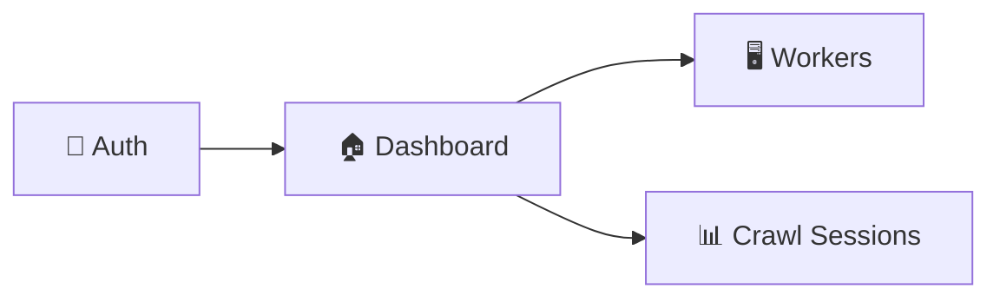

# ⚡ Flash Pick Monitor — Tổng Quan Dự Án

**Flash Pick Monitor** là hệ thống giám sát PC Worker theo thời gian thực, cho phép quản lý và điều khiển từ xa các máy trạm trong mạng nội bộ doanh nghiệp. Hệ thống cung cấp dashboard tổng hợp, quản lý phiên crawl dữ liệu, và streaming trực tiếp màn hình worker.

---

## Mục Lục

- [1. Thông Tin Dự Án](#1-thông-tin-dự-án)
- [2. Bối Cảnh & Mục Tiêu](#2-bối-cảnh--mục-tiêu)
- [3. Technology Stack](#3-technology-stack)
- [4. Cấu Trúc Module](#4-cấu-trúc-module)
- [5. Design System](#5-design-system)
- [6. Quick Start](#6-quick-start)
- [7. Tài Liệu Liên Quan](#7-tài-liệu-liên-quan)

---

## 1. Thông Tin Dự Án

| Thuộc tính | Giá trị |
|------------|---------|
| **Tên dự án** | Flash Pick Monitor |
| **Tagline** | Precision Monitoring V2.4.0 |
| **Framework** | Next.js 16 (App Router) |
| **Runtime** | React 19 |
| **Package Manager** | pnpm (workspace) |
| **Ngôn ngữ** | TypeScript strict mode |
| **Kiến trúc** | Modular Clean Architecture (5-layer) |

---

## 2. Bối Cảnh & Mục Tiêu

### 2.1. Bài Toán

Doanh nghiệp cần giám sát hàng chục đến hàng trăm PC worker phân tán trên nhiều cụm mạng. Mỗi worker chạy các tác vụ crawl dữ liệu, và cần được theo dõi tài nguyên (CPU, RAM), trạng thái mạng, và luồng dữ liệu theo thời gian thực.

### 2.2. Đối Tượng Sử Dụng

| Vai trò | Mô tả |
|---------|-------|
| **System Admin** | Quản lý toàn bộ worker fleet, deploy, restart |
| **Operator** | Giám sát phiên crawl, xử lý sự cố |
| **Viewer** | Xem dashboard tổng quan, không có quyền thay đổi |

### 2.3. Mục Tiêu Hệ Thống

- **Real-time monitoring**: Giám sát CPU, RAM, network speed của mỗi worker
- **Remote control**: Stream màn hình và điều khiển worker từ xa
- **Session management**: Quản lý phiên crawl (tạo, dừng, resume, xóa)
- **Alerting**: Cảnh báo khi worker offline hoặc tài nguyên vượt ngưỡng
- **Scalability**: Kiến trúc module cho phép thêm tính năng mà không ảnh hưởng module khác

---

## 3. Technology Stack

### 3.1. Core

| Layer | Công nghệ | Phiên bản |
|-------|-----------|-----------|
| Framework | Next.js (App Router) | 16.2.1 |
| UI Runtime | React | 19.2.4 |
| Language | TypeScript | ^5 |
| Compiler | babel-plugin-react-compiler | 1.0.0 |

### 3.2. Styling & UI

| Công nghệ | Mục đích |
|-----------|----------|
| Tailwind CSS v4 | Utility-first CSS |
| `class-variance-authority` (CVA) | Component variants |
| `clsx` + `tailwind-merge` | Class merging utility (`cn`) |
| `lucide-react` | Icon system |

### 3.3. Data & State (Planned)

| Công nghệ | Mục đích |
|-----------|----------|
| Tanstack Query (React Query) | Server state, data fetching |
| Axios | HTTP client |
| Zustand | Global state management |
| React Hook Form + Zod | Form handling & validation |
| Socket.io | Real-time communication |
| next-intl | Internationalization |

---

## 4. Cấu Trúc Module



| Module | Route | Mô tả |
|--------|-------|-------|
| **Auth** | `/login` | Xác thực người dùng, SSO, session management |
| **Dashboard** | `/dashboard` | Bảng điều khiển tổng quan: worker status, network, sessions, logs |
| **Workers** | `/workers` | Quản lý PC worker: bảng chi tiết, live stream, fullscreen control |
| **Crawl Sessions** | `/crawl-sessions` | Quản lý phiên crawl: progress, logs, actions (pause/resume/terminate) |

---

## 5. Design System

Hệ thống component tái sử dụng, stateless, xây dựng bằng CVA + Tailwind:

### 5.1. UI Components (`common/components/ui/`)

| Component | Mô tả |
|-----------|-------|
| `Button` | 7 variants (primary, secondary, ghost, destructive, link, icon-ghost, destructive-subtle), 6 sizes |
| `Input` | Text input với leading/trailing icons, error state, variant default/pill |
| `Textarea` | Multi-line input với label, error state |
| `Checkbox` | Checkbox + Toggle switch |
| `Badge` | 7 color variants, dot indicator, pulse animation |
| `ProgressBar` | 5 colors, 3 heights, optional label & shimmer animation |
| `BarChart` | Data-driven bar chart, gradient opacity, hover tooltip |
| `MetricCard` | KPI card với trend indicator (up/down) |
| `StatusDot` | Dot indicator nhỏ, có thể pulse |
| `SectionHeader` | Section title với icon, subtitle, action slot |
| `LogStream` | Terminal-style log viewer với color-coded levels |
| `IconBox` | Icon container với background color |

### 5.2. Overlay (`common/components/overlay/`)

| Component | Mô tả |
|-----------|-------|
| `Modal` | Compound component: Root, Overlay, Card, Header, Body, Footer. Animation enter/exit |

### 5.3. Layouts (`common/layouts/`)

| Component | Mô tả |
|-----------|-------|
| `DashboardLayout` | Sidebar collapsible + top bar + main content area |

---

## 6. Quick Start

### 6.1. Yêu Cầu

- **Node.js**: >= 20.x
- **pnpm**: >= 9.x
- **OS**: Windows / macOS / Linux

### 6.2. Cài Đặt & Chạy

```bash
# Clone repository
git clone <repo-url>
cd flash-pick-monitor/my-app

# Cài đặt dependencies
pnpm install

# Chạy development server
pnpm dev

# Build production
pnpm build

# Chạy production server
pnpm start

# Lint code
pnpm lint
```

### 6.3. Cấu Trúc Scripts

| Script | Mô tả |
|--------|-------|
| `pnpm dev` | Khởi chạy Next.js dev server (hot reload) |
| `pnpm build` | Build production bundle |
| `pnpm start` | Chạy production server |
| `pnpm lint` | Kiểm tra ESLint rules |

---

## 7. Tài Liệu Liên Quan

| # | Tài liệu | Mô tả |
|---|----------|-------|
| 00 | [Document Template](./00-DOCUMENT-TEMPLATE.md) | Quy chuẩn viết tài liệu |
| 02 | [Architecture](./02-ARCHITECTURE.md) | Kiến trúc hệ thống chi tiết |
| 03 | [Conventions](./03-CONVENTIONS.md) | Convention, coding rules |
| 04 | [Design System](./04-DESIGN-SYSTEM.md) | Catalog UI components |
| 05 | [State Management](./05-STATE-MANAGEMENT.md) | Chiến lược quản lý state |
| 06 | [API Integration](./06-API-INTEGRATION.md) | Hướng dẫn tích hợp API |
| 07 | [Configuration](./07-CONFIGURATION.md) | Cấu hình môi trường |
| 08 | [Deployment](./08-DEPLOYMENT.md) | Quy trình triển khai |
| 09 | [Troubleshooting](./09-TROUBLESHOOTING.md) | FAQ & xử lý sự cố |
| 10 | [Changelog](./10-CHANGELOG.md) | Lịch sử thay đổi |
