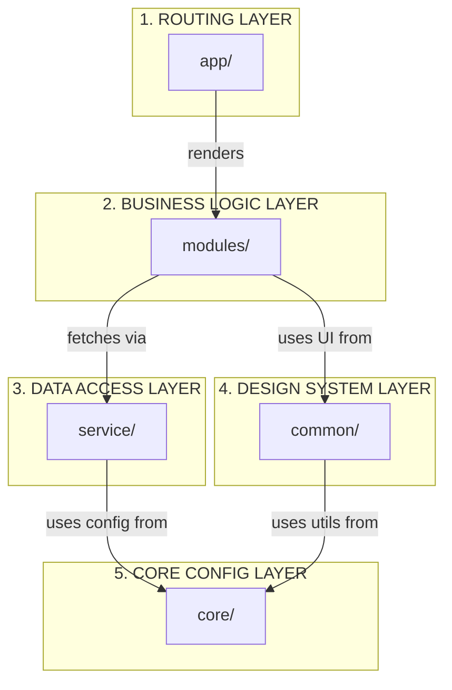
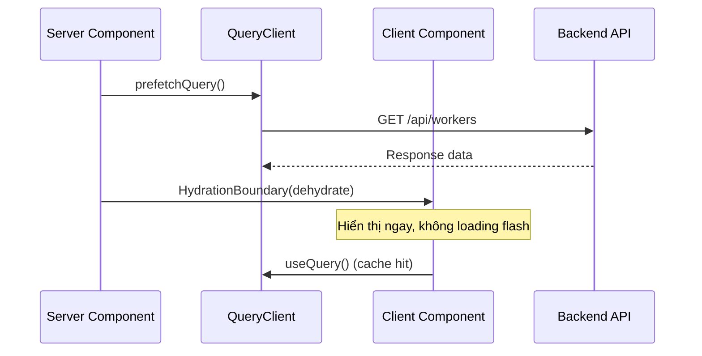
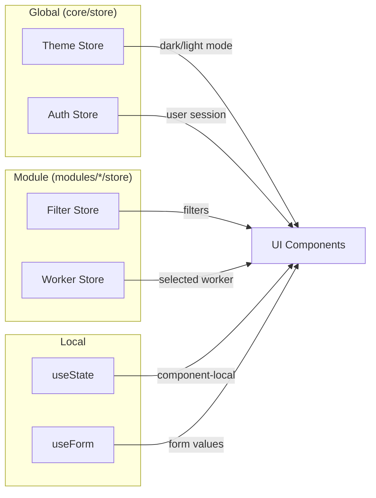

# 🏗️ Kiến Trúc Hệ Thống

Tài liệu mô tả kiến trúc tổng thể của Flash Pick Monitor, được thiết kế theo hướng **Modular Clean Architecture** 5 lớp, ưu tiên SSG/SSR, và tối ưu khả năng tái sử dụng mã nguồn.

---

## Mục Lục

- [1. Tổng Quan Kiến Trúc](#1-tổng-quan-kiến-trúc)
- [2. Mô Hình 5-Layer](#2-mô-hình-5-layer)
- [3. Directory Structure](#3-directory-structure)
- [4. Data Flow](#4-data-flow)
- [5. Component Architecture](#5-component-architecture)
- [6. Rendering Strategy](#6-rendering-strategy)

---

## 1. Tổng Quan Kiến Trúc



### Nguyên tắc cốt lõi

| # | Nguyên tắc | Mô tả |
|---|-----------|-------|
| 1 | **Separation of Concerns** | Mỗi layer chỉ biết layer ngay dưới nó |
| 2 | **Dependency Rule** | Dependencies chỉ đi một chiều: từ trên xuống dưới |
| 3 | **Feature-based Organization** | Code tổ chức theo tính năng (module), không theo type |
| 4 | **Stateless UI** | Components trong `common/` không chứa business logic |
| 5 | **Isolated Data Layer** | Service layer portable, không phụ thuộc UI |

---

## 2. Mô Hình 5-Layer

### Layer 1: Routing (`app/`)

**Trách nhiệm:** Chỉ xử lý routing, metadata SEO, và data prefetching.

```text
src/app/
├── (auth)/login/page.tsx       ← Route: /login
├── (dashboard)/
│   ├── dashboard/page.tsx      ← Route: /dashboard
│   ├── workers/page.tsx        ← Route: /workers
│   ├── crawl-sessions/page.tsx ← Route: /crawl-sessions
│   └── layout.tsx              ← DashboardLayout wrapper
├── globals.css                 ← Global styles & Tailwind
├── layout.tsx                  ← Root layout (providers)
└── page.tsx                    ← Landing / redirect
```

> [!IMPORTANT]
> Thư mục `app/` **tuyệt đối không** chứa UI logic hay business logic. Nó chỉ:
> - Xử lý Routing & Layout
> - Định nghĩa Metadata SEO
> - Prefetch data trên Server (SSR/SSG)
> - Gọi View component từ `modules/`

**Ví dụ page handler chuẩn:**

```typescript
// src/app/(dashboard)/workers/page.tsx
import { WorkersView } from '@/modules/workers';

export default function WorkersPage() {
  return <WorkersView />;
}
```

---

### Layer 2: Business Logic (`modules/`)

**Trách nhiệm:** Chứa toàn bộ logic nghiệp vụ, tổ chức theo tính năng.

```text
src/modules/
├── auth/
│   ├── components/     ← Components riêng của auth (LoginForm)
│   └── views/          ← Entry point (LoginView)
├── dashboard/
│   ├── components/     ← Components riêng (chưa tách)
│   └── views/          ← DashboardView
├── crawl-sessions/
│   ├── components/     ← ActionModal, ConfirmationModal
│   └── views/          ← CrawlSessionsView
└── workers/
    ├── components/     ← WorkerStatusBadge, WorkerResourceBars, MiniSparkline
    ├── data/           ← Mock data (mock-workers.ts)
    ├── types.ts        ← Domain types (Worker, WorkerStatus)
    ├── views/          ← WorkersView
    └── index.ts        ← Barrel export
```

**Cấu trúc chuẩn của một module:**

| Thư mục / File | Trách nhiệm |
|-----------------|------------|
| `components/` | Components đặc thù, chỉ dùng trong module này |
| `views/` | Entry point view, được gọi từ `app/` |
| `hooks/` | Custom hooks cho logic UI nội bộ |
| `store/` | Zustand slice riêng cho module |
| `schema/` | Zod validation schemas |
| `types.ts` | Domain types & interfaces |
| `data/` | Mock data (development) |
| `index.ts` | Barrel export (public API) |

---

### Layer 3: Data Access (`service/`)

**Trách nhiệm:** Đóng gói toàn bộ giao tiếp API, hoàn toàn độc lập với UI.

```text
src/service/
├── common/
│   └── types.ts        ← Type chung (ApiResponse, PaginationParams)
└── [feature-name]/     ← VD: worker, session
    ├── api.ts          ← Thuần Axios calls
    ├── query.ts        ← Custom hooks useQuery
    ├── mutation.ts     ← Custom hooks useMutation
    ├── types.ts        ← DTOs, Interfaces
    └── index.ts        ← Barrel export
```

> [!WARNING]
> **Không bao giờ** import trực tiếp `axios` trong file UI/Component. Mọi data fetching phải thông qua hooks từ `service/`.

---

### Layer 4: Design System (`common/`)

**Trách nhiệm:** UI components tái sử dụng, hoàn toàn stateless.

```text
src/common/
├── components/
│   ├── ui/             ← Button, Input, Badge, ProgressBar, BarChart...
│   ├── form/           ← Wrapper cho React Hook Form
│   └── overlay/        ← Modal (compound component)
├── layouts/            ← DashboardLayout
├── icons/              ← SVG/Lucide wrappers
└── utils/
    └── cn.ts           ← clsx + tailwind-merge helper
```

**Quy tắc bắt buộc cho mọi component trong `common/`:**

| Rule | Chi tiết |
|------|----------|
| No side-effects | Không gọi API, không `useEffect` cho data |
| `forwardRef` | Tương thích React Hook Form & animation libs |
| CVA + `cn` | Quản lý variants và merge classes |
| Barrel export | `index.ts` ở mỗi thư mục con |

---

### Layer 5: Core Config (`core/`)

**Trách nhiệm:** Cấu hình nền tảng, không chứa UI.

```text
src/core/
├── config/             ← Biến môi trường, hằng số
├── axios/              ← Axios instance & interceptors
├── store/              ← Global Zustand store (theme, auth session)
├── hooks/              ← Global hooks (useDebounce, useWindowSize)
└── utils/              ← Formatters (date, currency)
```

---

## 3. Directory Structure

Toàn bộ cấu trúc thư mục chi tiết:

```text
src/
├── app/                         # 1. ROUTING LAYER
│   ├── (auth)/login/page.tsx
│   ├── (dashboard)/
│   │   ├── dashboard/page.tsx
│   │   ├── workers/page.tsx
│   │   ├── crawl-sessions/page.tsx
│   │   └── layout.tsx
│   ├── globals.css
│   ├── layout.tsx
│   └── page.tsx
├── modules/                     # 2. BUSINESS LOGIC LAYER
│   ├── auth/
│   ├── dashboard/
│   ├── crawl-sessions/
│   └── workers/
├── service/                     # 3. DATA ACCESS LAYER (planned)
├── common/                      # 4. DESIGN SYSTEM LAYER
│   ├── components/
│   │   ├── ui/
│   │   ├── form/
│   │   └── overlay/
│   ├── layouts/
│   ├── icons/
│   └── utils/
└── core/                        # 5. CORE CONFIG LAYER (planned)
```

---

## 4. Data Flow

### 4.1. SSR/SSG Hydration Pattern



**Ví dụ chuẩn:**

```typescript
// src/app/(dashboard)/dashboard/page.tsx
import { dehydrate, HydrationBoundary, QueryClient } from '@tanstack/react-query';
import { workerApi, workerKeys } from '@/service/worker';
import { DashboardView } from '@/modules/dashboard/views';

export default async function DashboardPage() {
  const queryClient = new QueryClient();

  await queryClient.prefetchQuery({
    queryKey: workerKeys.list(),
    queryFn: () => workerApi.getWorkers(),
  });

  return (
    <HydrationBoundary state={dehydrate(queryClient)}>
      <DashboardView />
    </HydrationBoundary>
  );
}
```

### 4.2. State Management Flow



**Quy tắc chọn state store:**

| State type | Ở đâu | Công cụ |
|-----------|--------|---------|
| Theme, auth session | `core/store/` | Zustand |
| Module-specific (filters, selection) | `modules/*/store/` | Zustand |
| Component-local (open/close, hover) | Trong component | `useState` |
| Form values | Trong form component | `useForm` |

---

## 5. Component Architecture

### 5.1. Compound Component Pattern

Modal là ví dụ điển hình — sử dụng Context + composition thay vì boolean props:

```typescript
// ❌ SAI: Boolean prop proliferation
<Modal
  isOpen={true}
  showHeader={true}
  showFooter={true}
  accentColor="red"
  title="Delete?"
/>

// ✅ ĐÚNG: Compound composition
<Modal.Root isOpen={isOpen} onClose={onClose}>
  <Modal.Overlay />
  <Modal.Card accentColor="red">
    <Modal.Header title="Delete?" icon={<AlertTriangle />} />
    <Modal.Body>Are you sure?</Modal.Body>
    <Modal.Footer>
      <Button variant="destructive">Confirm</Button>
    </Modal.Footer>
  </Modal.Card>
</Modal.Root>
```

### 5.2. CVA Variant Pattern

Mọi component trong `common/ui/` sử dụng `class-variance-authority`:

```typescript
const buttonVariants = cva(
  'inline-flex items-center justify-center gap-2 ...base-styles',
  {
    variants: {
      variant: {
        primary:   'bg-primary text-white ...',
        secondary: 'bg-surface-container ...',
        ghost:     'bg-white/5 text-zinc-400 ...',
      },
      size: {
        sm: 'text-[10px] px-3 py-1.5 rounded-lg',
        md: 'text-xs px-4 py-2.5 rounded-xl',
      },
    },
    defaultVariants: { variant: 'secondary', size: 'md' },
  },
);
```

---

## 6. Rendering Strategy

### 6.1. Server vs Client Components

| Tiêu chí | Server Component | Client Component |
|----------|-----------------|-----------------|
| Mặc định | ✅ (Next.js App Router default) | Cần `'use client'` |
| Data fetching | `async/await` trực tiếp | Qua hooks (useQuery) |
| State / Effects | ❌ | ✅ |
| Event handlers | ❌ | ✅ |
| Dùng cho | Page, Layout, data wrapper | Interactive UI, forms |

### 6.2. Khi Nào Dùng Client

Thêm `'use client'` khi component cần:
- `useState`, `useEffect`, `useRef`
- Event handlers (`onClick`, `onSubmit`)
- Browser APIs (`localStorage`, `fullscreen`)
- Third-party client libs (Zustand, React Hook Form)

> [!TIP]
> Đẩy `'use client'` xuống component nhỏ nhất có thể. Không đặt ở page level.

---

## Tài Liệu Liên Quan

| Tài liệu | Mô tả |
|-----------|--------|
| [Overview](./01-OVERVIEW.md) | Tổng quan dự án |
| [Conventions](./03-CONVENTIONS.md) | Convention & coding rules |
| [Design System](./04-DESIGN-SYSTEM.md) | Catalog UI components |
| [State Management](./05-STATE-MANAGEMENT.md) | Chiến lược quản lý state |
| [API Integration](./06-API-INTEGRATION.md) | Hướng dẫn tích hợp API |
