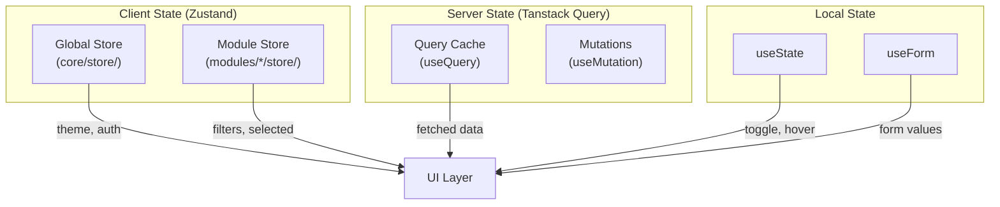
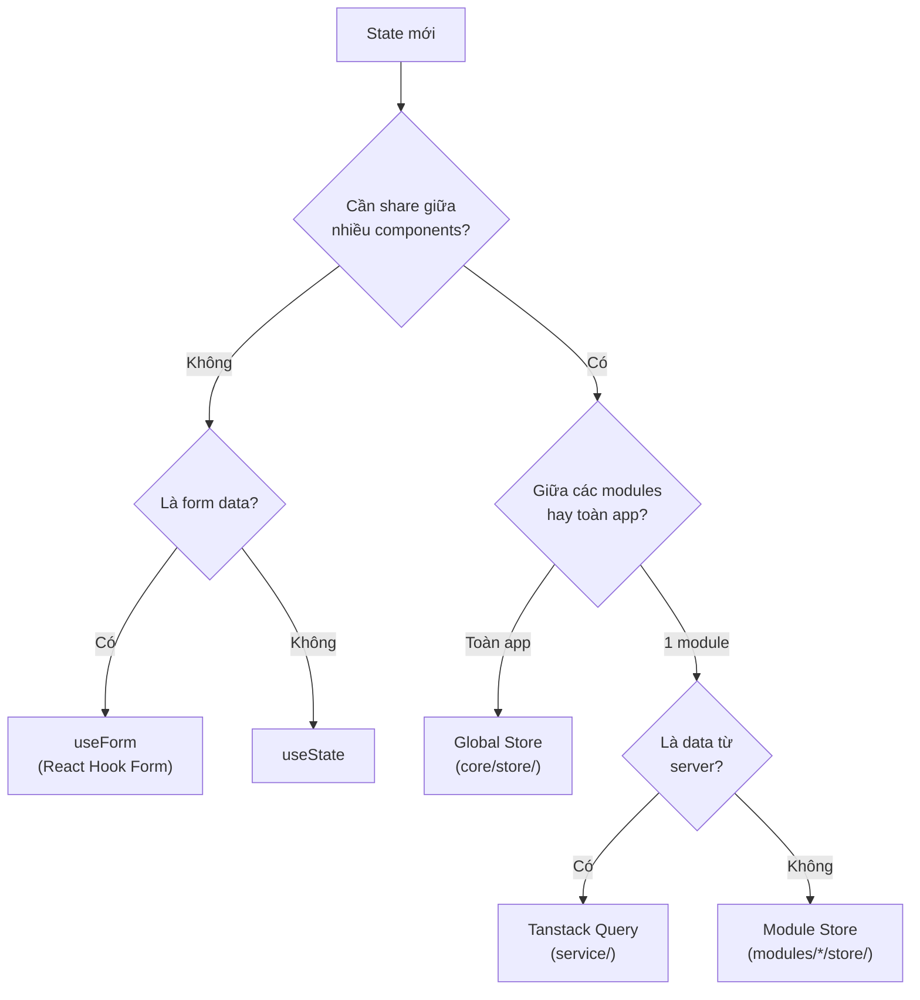

# 🧠 State Management Strategy

Tài liệu mô tả chiến lược quản lý state trong Flash Pick Monitor, sử dụng Zustand cho global/module state, kết hợp Tanstack Query cho server state.

---

## Mục Lục

- [1. Tổng Quan](#1-tổng-quan)
- [2. Phân Loại State](#2-phân-loại-state)
- [3. Global Store](#3-global-store)
- [4. Module Store](#4-module-store)
- [5. Server State](#5-server-state)
- [6. Anti-patterns](#6-anti-patterns)

---

## 1. Tổng Quan



---

## 2. Phân Loại State

| Loại | Scope | Công cụ | Vị trí | Ví dụ |
|------|-------|---------|--------|-------|
| **Global Client** | Toàn app | Zustand | `core/store/` | Theme, auth session, socket status |
| **Module Client** | 1 module | Zustand | `modules/*/store/` | Worker filters, selected row |
| **Server** | Backend data | Tanstack Query | `service/*/query.ts` | Worker list, session details |
| **Local** | 1 component | `useState` | Trong component | Modal open, dropdown toggle |
| **Form** | 1 form | React Hook Form | Trong form component | Login fields, worker form |

### Quy Tắc Quyết Định



---

## 3. Global Store

### 3.1. Vị Trí

```text
src/core/store/
├── themeStore.ts       ← Dark/light mode
├── authStore.ts        ← User session, token
├── socketStore.ts      ← Socket.io connection status
└── index.ts            ← Barrel export
```

### 3.2. Template Chuẩn

```typescript
// core/store/themeStore.ts
import { create } from 'zustand';
import { persist } from 'zustand/middleware';

interface ThemeState {
  mode: 'dark' | 'light';
  setMode: (mode: 'dark' | 'light') => void;
  toggle: () => void;
}

export const useThemeStore = create<ThemeState>()(
  persist(
    (set) => ({
      mode: 'dark',
      setMode: (mode) => set({ mode }),
      toggle: () => set((s) => ({ mode: s.mode === 'dark' ? 'light' : 'dark' })),
    }),
    { name: 'fpm-theme' },  // localStorage key
  ),
);
```

### 3.3. Auth Store

```typescript
// core/store/authStore.ts
interface AuthState {
  user: User | null;
  token: string | null;
  isAuthenticated: boolean;
  setAuth: (user: User, token: string) => void;
  clearAuth: () => void;
}

export const useAuthStore = create<AuthState>()((set) => ({
  user: null,
  token: null,
  isAuthenticated: false,
  setAuth: (user, token) => set({ user, token, isAuthenticated: true }),
  clearAuth: () => set({ user: null, token: null, isAuthenticated: false }),
}));
```

---

## 4. Module Store

### 4.1. Vị Trí

```text
src/modules/workers/store/
└── workerViewStore.ts   ← Selected worker, view filters
```

### 4.2. Template

```typescript
// modules/workers/store/workerViewStore.ts
import { create } from 'zustand';

interface WorkerViewState {
  selectedWorkerId: string | null;
  statusFilter: WorkerStatus | 'all';
  searchQuery: string;

  selectWorker: (id: string | null) => void;
  setStatusFilter: (status: WorkerStatus | 'all') => void;
  setSearchQuery: (query: string) => void;
  reset: () => void;
}

const initialState = {
  selectedWorkerId: null,
  statusFilter: 'all' as const,
  searchQuery: '',
};

export const useWorkerViewStore = create<WorkerViewState>()((set) => ({
  ...initialState,
  selectWorker: (id) => set({ selectedWorkerId: id }),
  setStatusFilter: (status) => set({ statusFilter: status }),
  setSearchQuery: (query) => set({ searchQuery: query }),
  reset: () => set(initialState),
}));
```

---

## 5. Server State

### 5.1. Tanstack Query Integration

Server state **không** lưu trong Zustand. Sử dụng Tanstack Query:

```typescript
// service/worker/query.ts
import { useQuery, useSuspenseQuery } from '@tanstack/react-query';
import { workerApi } from './api';
import { workerKeys } from './keys';

// Standard query (loading state)
export const useWorkerListQuery = (filters?: WorkerFilters) =>
  useQuery({
    queryKey: workerKeys.list(filters),
    queryFn: () => workerApi.getWorkers(filters),
    staleTime: 5_000,        // 5s trước khi refetch
    refetchInterval: 10_000,  // Polling mỗi 10s (real-time)
  });

// Suspense query (no loading state, streamed from server)
export const useWorkerDetailSuspense = (id: string) =>
  useSuspenseQuery({
    queryKey: workerKeys.detail(id),
    queryFn: () => workerApi.getWorkerById(id),
  });
```

### 5.2. Mutation Pattern

```typescript
// service/worker/mutation.ts
import { useMutation, useQueryClient } from '@tanstack/react-query';
import { workerApi } from './api';
import { workerKeys } from './keys';

export const useRestartWorkerMutation = () => {
  const queryClient = useQueryClient();

  return useMutation({
    mutationFn: (id: string) => workerApi.restartWorker(id),
    onSuccess: () => {
      // Invalidate cache → triggers refetch
      queryClient.invalidateQueries({ queryKey: workerKeys.all });
    },
  });
};
```

---

## 6. Anti-patterns

### 6.1. Không Dùng Zustand Cho Mọi State

```typescript
// ❌ SAI: Zustand cho state chỉ dùng trong 1 component
const useDropdownStore = create(() => ({ isOpen: false }));

// ✅ ĐÚNG: useState đủ rồi
const [isOpen, setIsOpen] = useState(false);
```

### 6.2. Không Lưu Server Data Trong Zustand

```typescript
// ❌ SAI: Copy server data vào Zustand
const useWorkerStore = create((set) => ({
  workers: [],
  fetchWorkers: async () => {
    const res = await axios.get('/api/workers');
    set({ workers: res.data });
  },
}));

// ✅ ĐÚNG: Dùng Tanstack Query
const { data: workers } = useWorkerListQuery();
```

### 6.3. Không Mix Global và Module State

```typescript
// ❌ SAI: State cụ thể module trong global store
// core/store/globalStore.ts
{ selectedWorkerId: null }   // Thuộc về workers module!

// ✅ ĐÚNG: Đặt trong module store
// modules/workers/store/workerViewStore.ts
{ selectedWorkerId: null }
```

---

## Tài Liệu Liên Quan

| Tài liệu | Mô tả |
|-----------|--------|
| [Architecture](./02-ARCHITECTURE.md) | Kiến trúc hệ thống |
| [API Integration](./06-API-INTEGRATION.md) | Service layer guide |
| [Conventions](./03-CONVENTIONS.md) | Coding rules |
