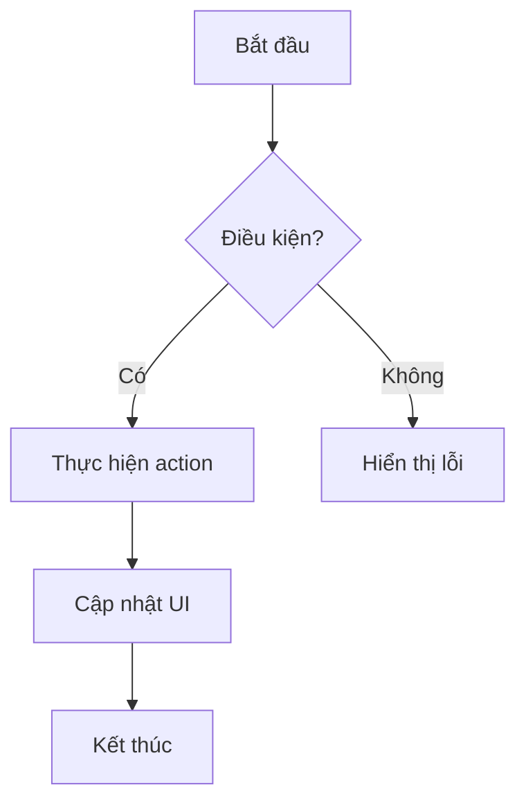

# 📦 [TÊN MODULE] — Đặc Tả Tính Năng

Mô tả ngắn gọn 1-2 câu về module: mục đích, đối tượng sử dụng, vai trò trong hệ thống.

---

## Mục Lục

- [1. Tổng Quan](#1-tổng-quan)
- [2. Cấu Trúc Thư Mục](#2-cấu-trúc-thư-mục)
- [3. Giao Diện (UI Screens)](#3-giao-diện-ui-screens)
- [4. Luồng Nghiệp Vụ](#4-luồng-nghiệp-vụ)
- [5. Components](#5-components)
- [6. API Endpoints](#6-api-endpoints)
- [7. State Management](#7-state-management)
- [8. Validation Schema](#8-validation-schema)
- [9. Edge Cases & Error Handling](#9-edge-cases--error-handling)
- [10. Dependencies](#10-dependencies)
- [11. Changelog](#11-changelog)

---

## 1. Tổng Quan

| Thuộc tính | Giá trị |
|------------|---------|
| **Module name** | `[tên-module]` |
| **Route** | `/[route-path]` |
| **Layer** | Business Logic (`modules/[tên-module]/`) |
| **Status** | `Draft` / `In Development` / `Production` |
| **Owner** | `[team/person]` |

### 1.1. Mục Đích

[Mô tả chi tiết bài toán mà module giải quyết]

### 1.2. Đối Tượng Sử Dụng

| Vai trò | Quyền hạn |
|---------|----------|
| Admin | Toàn quyền |
| Operator | Xem + thao tác cơ bản |
| Viewer | Chỉ xem |

---

## 2. Cấu Trúc Thư Mục

```text
src/modules/[tên-module]/
├── components/            ← Components đặc thù
│   ├── [Component1].tsx
│   ├── [Component2].tsx
│   └── index.ts           ← Barrel export
├── hooks/                 ← Custom hooks (nếu cần)
│   └── use[HookName].ts
├── store/                 ← Zustand slice (nếu cần)
│   └── [moduleName]Store.ts
├── schema/                ← Zod schemas
│   └── [action].schema.ts
├── views/                 ← Entry point views
│   └── [ModuleName]View.tsx
├── types.ts               ← Domain types
├── data/                  ← Mock data (dev only)
│   └── mock-[data].ts
└── index.ts               ← Barrel export (public API)
```

---

## 3. Giao Diện (UI Screens)

### 3.1. [Tên Screen 1]

**Mô tả:** [Mô tả screen]

**Layout:**
```
┌─────────────────────────────────────────┐
│ Header: [Title] + [Actions]             │
├─────────────────────────────────────────┤
│ [Main Content Area]                     │
│                                         │
│ [Table / Cards / Form]                  │
│                                         │
├─────────────────────────────────────────┤
│ Footer / Pagination                     │
└─────────────────────────────────────────┘
```

**Components sử dụng:**
- `Button` (variant: primary, ghost)
- `Badge` (variant: success, error)
- ...

---

## 4. Luồng Nghiệp Vụ

### 4.1. [Tên Luồng 1]

**Trigger:** [Sự kiện kích hoạt luồng]



**Mô tả chi tiết:**
1. Bước 1: [Mô tả]
2. Bước 2: [Mô tả]
3. Bước 3: [Mô tả]

### 4.2. [Tên Luồng 2]

...

---

## 5. Components

### 5.1. Module-specific Components

| Component | File | Props chính | Mô tả |
|-----------|------|------------|-------|
| `[Component1]` | `components/[Component1].tsx` | `prop1`, `prop2` | [Mô tả] |
| `[Component2]` | `components/[Component2].tsx` | `prop1` | [Mô tả] |

### 5.2. Design System Components Sử Dụng

| Component | Variant/Config | Mục đích |
|-----------|---------------|----------|
| `Button` | `variant="primary"` | CTA chính |
| `Badge` | `variant="success", dot, pulse` | Status indicator |
| `Modal` | Compound (Root, Overlay, Card) | Dialog actions |

---

## 6. API Endpoints

| # | Method | Endpoint | Request Body | Response | Mô tả |
|---|--------|----------|-------------|----------|-------|
| 1 | `GET` | `/api/[resource]` | — | `PaginatedResponse<T>` | Lấy danh sách |
| 2 | `GET` | `/api/[resource]/:id` | — | `ApiResponse<T>` | Lấy chi tiết |
| 3 | `POST` | `/api/[resource]` | `CreateDto` | `ApiResponse<T>` | Tạo mới |
| 4 | `PUT` | `/api/[resource]/:id` | `UpdateDto` | `ApiResponse<T>` | Cập nhật |
| 5 | `DELETE` | `/api/[resource]/:id` | — | `ApiResponse<void>` | Xóa |

---

## 7. State Management

### 7.1. Module Store (nếu có)

```typescript
interface [ModuleName]ViewState {
  // Liệt kê state
  selected[Item]Id: string | null;
  filter: [FilterType];

  // Actions
  select[Item]: (id: string | null) => void;
  setFilter: (filter: [FilterType]) => void;
}
```

### 7.2. Server State (Tanstack Query)

| Hook | Query Key | Mô tả |
|------|-----------|-------|
| `use[Resource]ListQuery` | `['[resources]', 'list', filters]` | Danh sách |
| `use[Resource]DetailQuery` | `['[resources]', 'detail', id]` | Chi tiết |

---

## 8. Validation Schema

```typescript
// schema/[action].schema.ts
import { z } from 'zod';

export const create[Resource]Schema = z.object({
  name: z.string().min(1, 'Tên không được để trống'),
  // ...các trường khác
});

export type Create[Resource]FormData = z.infer<typeof create[Resource]Schema>;
```

---

## 9. Edge Cases & Error Handling

| # | Tình huống | Xử lý |
|---|-----------|-------|
| 1 | API trả lỗi 500 | Hiển thị error toast + retry button |
| 2 | Mất kết nối mạng | Hiển thị offline indicator |
| 3 | Data rỗng | Hiển thị empty state illustration |
| 4 | Concurrent updates | Refetch data sau mutation |

---

## 10. Dependencies

### 10.1. Internal (Cross-module)

| Module | Mục đích |
|--------|----------|
| `common/components/ui` | Design system components |
| `common/components/overlay` | Modal compound component |
| `core/store` | Global state (auth, theme) |

### 10.2. External Packages

| Package | Mục đích |
|---------|----------|
| `lucide-react` | Icons |
| `zod` | Validation |

---

## 11. Changelog

| Version | Ngày | Mô tả |
|---------|------|-------|
| 1.0.0 | YYYY-MM-DD | Khởi tạo module |
