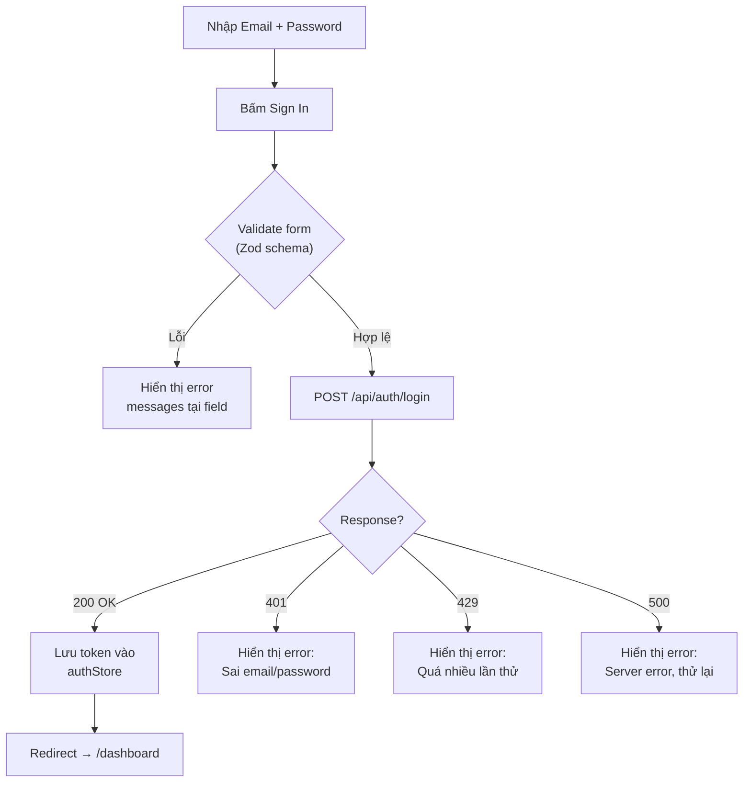
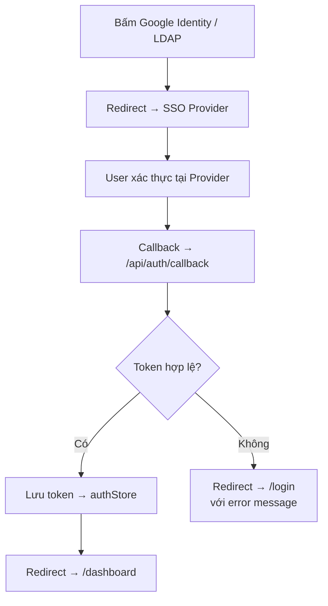
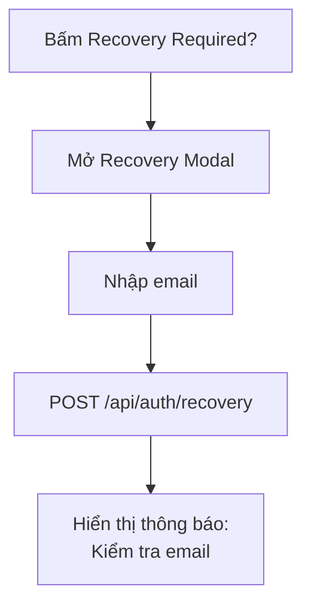

# 🔐 Auth Module — Đặc Tả Tính Năng

Module xác thực người dùng, cung cấp giao diện đăng nhập với hỗ trợ credential-based login và Enterprise SSO. Là gateway duy nhất để truy cập hệ thống Flash Pick Monitor.

---

## Mục Lục

- [1. Tổng Quan](#1-tổng-quan)
- [2. Cấu Trúc Thư Mục](#2-cấu-trúc-thư-mục)
- [3. Giao Diện](#3-giao-diện)
- [4. Luồng Nghiệp Vụ](#4-luồng-nghiệp-vụ)
- [5. Components](#5-components)
- [6. API Endpoints](#6-api-endpoints)
- [7. State Management](#7-state-management)
- [8. Validation Schema](#8-validation-schema)
- [9. Edge Cases & Error Handling](#9-edge-cases--error-handling)
- [10. Dependencies](#10-dependencies)
- [11. Changelog](#11-changelog)

---

## 1. Tổng Quan

| Thuộc tính | Giá trị |
|------------|---------|
| **Module name** | `auth` |
| **Route** | `/login` |
| **Route Group** | `(auth)` — layout riêng, không có sidebar |
| **Layer** | Business Logic (`modules/auth/`) |
| **Status** | Production (UI) / Planned (API integration) |

### 1.1. Mục Đích

Cung cấp xác thực an toàn cho người dùng trước khi truy cập dashboard. Hỗ trợ:
- Đăng nhập bằng email + password (credential-based)
- Đăng nhập qua Enterprise SSO (Google Identity, LDAP)
- Duy trì phiên đăng nhập (remember me)

### 1.2. Đối Tượng Sử Dụng

| Vai trò | Quyền hạn |
|---------|----------|
| Mọi người dùng | Đăng nhập để truy cập hệ thống |

---

## 2. Cấu Trúc Thư Mục

```text
src/modules/auth/
├── components/
│   └── LoginForm.tsx       ← Form đăng nhập + SSO buttons
├── views/
│   └── LoginView.tsx       ← Entry point: layout 2-column
└── index.ts                ← Barrel export
```

**Planned (chưa implement):**
```text
├── hooks/
│   └── useAuth.ts          ← Hook quản lý auth state
├── schema/
│   └── login.schema.ts     ← Zod validation
└── store/
    └── authStore.ts        ← → sẽ đặt tại core/store/
```

---

## 3. Giao Diện

### 3.1. Login Screen

**Route:** `/login`
**Layout:** Full-screen, no sidebar (route group `(auth)`)
**Aesthetic:** Kinetic Glass — dark, glassmorphism, orange accents

```
┌─────────────────────────────────────────────────────┐
│                                                     │
│  ┌──────────────────┐  ┌────────────────────────┐   │
│  │                  │  │                        │   │
│  │  Network Pulse   │  │  ┌──────────────────┐  │   │
│  │  (decoration)    │  │  │  Shield Icon     │  │   │
│  │                  │  │  │  FLASH PICK      │  │   │
│  │  Animated grid   │  │  │  MONITOR         │  │   │
│  │  visualization   │  │  ├──────────────────┤  │   │
│  │                  │  │  │  Email Input     │  │   │
│  │                  │  │  │  Password Input  │  │   │
│  │                  │  │  │  Remember Me     │  │   │
│  │                  │  │  │  [Sign In]       │  │   │
│  │                  │  │  ├──────────────────┤  │   │
│  │                  │  │  │  SSO: Google/LDAP│  │   │
│  │                  │  │  └──────────────────┘  │   │
│  └──────────────────┘  └────────────────────────┘   │
│                                                     │
└─────────────────────────────────────────────────────┘
```

**Design System components sử dụng:**

| Component | Config | Vị trí |
|-----------|--------|--------|
| `Input` | `variant="pill"`, `size="lg"`, `leadingIcon` | Email, Password fields |
| `Button` | `variant="primary"`, `size="pill"` | Sign In CTA |
| `Button` | `variant="ghost"`, `size="pill"` | SSO buttons |
| `Button` | `variant="link"`, `size="sm"` | Recovery link |
| `Checkbox` | Default checkbox | Remember me toggle |

---

## 4. Luồng Nghiệp Vụ

### 4.1. Đăng Nhập Credential



### 4.2. Đăng Nhập SSO



### 4.3. Password Recovery



---

## 5. Components

### 5.1. Module-specific Components

| Component | File | Mô tả |
|-----------|------|-------|
| `LoginForm` | `components/LoginForm.tsx` | Form đăng nhập: email, password, remember me, SSO buttons |
| `LoginView` | `views/LoginView.tsx` | Layout 2-column: Network Pulse (trái) + LoginForm (phải) |

### 5.2. LoginForm Chi Tiết

**State:**
- `showPassword` (`useState`) — toggle password visibility
- `maintainSession` (`useState`) — remember me checkbox

**Interactions:**
- `AtSign` icon → email leading icon
- `Key` icon → password leading icon
- `Eye/EyeOff` toggle → password trailing icon (interactive button)
- `ArrowRight` icon → submit button icon

---

## 6. API Endpoints

| # | Method | Endpoint | Request | Response | Mô tả |
|---|--------|----------|---------|----------|-------|
| 1 | `POST` | `/api/auth/login` | `{ email, password, maintainSession }` | `{ token, user, expiresIn }` | Credential login |
| 2 | `GET` | `/api/auth/me` | Header: `Authorization` | `{ user }` | Lấy user hiện tại |
| 3 | `POST` | `/api/auth/logout` | Header: `Authorization` | `{ success }` | Đăng xuất |
| 4 | `GET` | `/api/auth/sso/:provider` | — | Redirect URL | Khởi tạo SSO flow |
| 5 | `GET` | `/api/auth/callback` | Query: `code, state` | `{ token, user }` | SSO callback |
| 6 | `POST` | `/api/auth/recovery` | `{ email }` | `{ success }` | Gửi email recovery |

---

## 7. State Management

### 7.1. Auth Store (Global — `core/store/`)

```typescript
interface AuthState {
  user: User | null;
  token: string | null;
  isAuthenticated: boolean;
  isLoading: boolean;

  setAuth: (user: User, token: string) => void;
  clearAuth: () => void;
  checkAuth: () => Promise<void>;
}
```

> [!NOTE]
> Auth state là **global** vì mọi module cần biết user đã đăng nhập hay chưa. Đặt tại `core/store/authStore.ts`, không phải `modules/auth/store/`.

---

## 8. Validation Schema

```typescript
// modules/auth/schema/login.schema.ts
import { z } from 'zod';

export const loginSchema = z.object({
  email: z
    .string()
    .min(1, 'Email không được để trống')
    .email('Email không hợp lệ'),
  password: z
    .string()
    .min(8, 'Mật khẩu tối thiểu 8 ký tự')
    .max(128, 'Mật khẩu tối đa 128 ký tự'),
  maintainSession: z.boolean().default(true),
});

export type LoginFormData = z.infer<typeof loginSchema>;
```

---

## 9. Edge Cases & Error Handling

| # | Tình huống | Xử lý |
|---|-----------|-------|
| 1 | Email/password sai | Hiển thị error inline tại form, clear password field |
| 2 | Rate limit (429) | Hiển thị countdown timer, disable form |
| 3 | Server unavailable (500) | Error toast + retry button |
| 4 | Token hết hạn (access protected route) | Redirect → `/login` với message "Session expired" |
| 5 | SSO provider lỗi | Redirect → `/login` với error query param |
| 6 | User đã đăng nhập, vào `/login` | Auto-redirect → `/dashboard` |

---

## 10. Dependencies

### 10.1. Internal

| Module / Layer | Mục đích |
|----------------|----------|
| `common/components/ui/Input` | Email & password fields |
| `common/components/ui/Button` | Sign In, SSO buttons |
| `common/components/ui/Checkbox` | Remember me |
| `core/store/authStore` | Lưu token, user session |

### 10.2. External

| Package | Mục đích |
|---------|----------|
| `lucide-react` | Icons (AtSign, Key, Eye, ArrowRight, Shield, Terminal) |
| `zod` | Form validation (planned) |
| `react-hook-form` | Form management (planned) |

---

## 11. Changelog

| Version | Ngày | Mô tả |
|---------|------|-------|
| 1.0.0 | 2026-03-27 | Khởi tạo: LoginView layout + LoginForm UI |
| 1.1.0 | 2026-03-28 | Refactor: Kinetic Glass aesthetic, design system integration |
