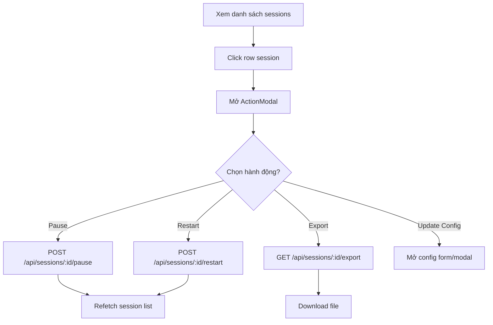
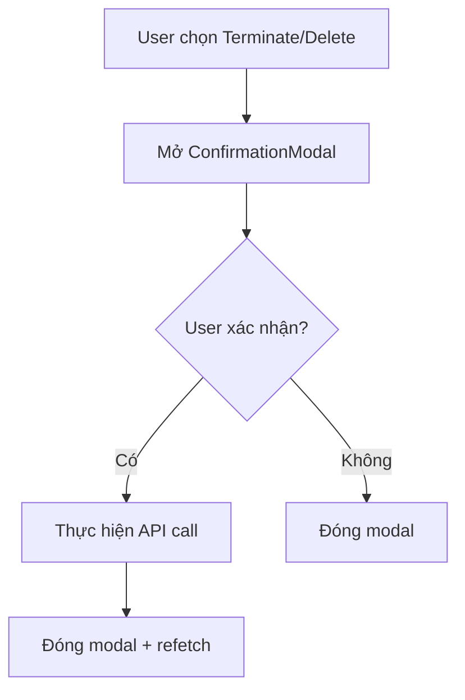
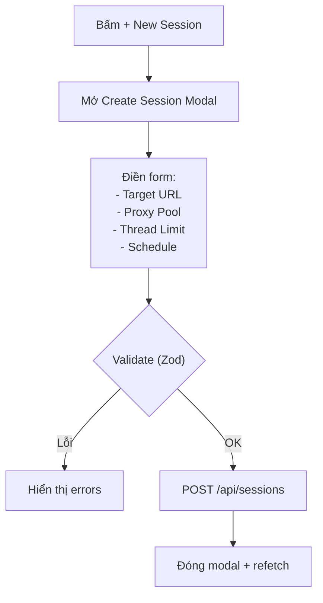

# 📊 Crawl Sessions Module — Đặc Tả Tính Năng

Module quản lý phiên crawl dữ liệu: theo dõi tiến trình, thực thi hành động (pause, restart, export, update config), và xem log chi tiết từng session.

---

## Mục Lục

- [1. Tổng Quan](#1-tổng-quan)
- [2. Cấu Trúc Thư Mục](#2-cấu-trúc-thư-mục)
- [3. Giao Diện](#3-giao-diện)
- [4. Luồng Nghiệp Vụ](#4-luồng-nghiệp-vụ)
- [5. Components](#5-components)
- [6. API Endpoints](#6-api-endpoints)
- [7. State Management](#7-state-management)
- [8. Edge Cases & Error Handling](#8-edge-cases--error-handling)
- [9. Dependencies](#9-dependencies)
- [10. Changelog](#10-changelog)

---

## 1. Tổng Quan

| Thuộc tính | Giá trị |
|------------|---------|
| **Module name** | `crawl-sessions` |
| **Route** | `/crawl-sessions` |
| **Route Group** | `(dashboard)` — DashboardLayout sidebar |
| **Layer** | Business Logic (`modules/crawl-sessions/`) |
| **Status** | Production (UI components) / Planned (full view) |

### 1.1. Mục Đích

Quản lý vòng đời phiên crawl dữ liệu:
- **Tạo** session mới với cấu hình (target, proxy pool, thread limit)
- **Giám sát** tiến trình: progress bar, items parsed, error count
- **Thao tác** trực tiếp: pause, restart, export logs, update config
- **Xác nhận** hành động nguy hiểm: terminate, delete

---

## 2. Cấu Trúc Thư Mục

```text
src/modules/crawl-sessions/
├── components/
│   ├── ActionModal.tsx           ← Modal chọn hành động cho session
│   ├── ConfirmationModal.tsx     ← Modal xác nhận hành động nguy hiểm
│   └── index.ts                  ← Barrel export
├── views/                        ← (Planned)
│   └── CrawlSessionsView.tsx
└── index.ts
```

---

## 3. Giao Diện

### 3.1. Sessions List View (Planned)

```
┌──────────────────────────────────────────────────────────┐
│  Data Crawl Sessions             [+ New Session] [Filter]│
├──────────────────────────────────────────────────────────┤
│  ID        │ Target        │ Status   │ Progress │ Items │
│────────────┼───────────────┼──────────┼──────────┼───────│
│  SID-88210 │ bloomberg     │ Crawling │ ████ 84% │142,903│
│  SID-88211 │ sentiment     │ Verify   │ ████100% │ 12,442│
│  SID-88212 │ crypto        │ Stalled  │ ██   12% │  2,105│
├──────────────────────────────────────────────────────────┤
│  [Click row → ActionModal]                               │
└──────────────────────────────────────────────────────────┘
```

### 3.2. Action Modal

**Trigger:** Click hàng session trong bảng

```
┌──────────────────────────────────────┐
│  Crawl Session Management      [x]  │
│  Configure session #SID-88210-X      │
├──────────────────────────────────────┤
│  ┌──────────────────────────────┐    │
│  │ ⏸ Pause Session             │    │
│  │   Stop all worker threads    │    │
│  └──────────────────────────────┘    │
│  ┌──────────────────────────────┐    │
│  │ 🔄 Restart Session           │    │
│  │   Clear queue, re-initialize │    │
│  └──────────────────────────────┘    │
│  ┌──────────────────────────────┐    │
│  │ 📥 Export Logs               │    │
│  │   Download as JSON/CSV       │    │
│  └──────────────────────────────┘    │
│  ┌──────────────────────────────┐    │
│  │ ⚙️ Update Configuration      │    │
│  │   Modify proxy/thread limits │    │
│  └──────────────────────────────┘    │
│                                      │
│  [Apply Changes]        [Dismiss]    │
└──────────────────────────────────────┘
```

### 3.3. Confirmation Modal

**Trigger:** Chọn hành động nguy hiểm (terminate, delete)

```
┌──────────────────────────────────────┐
│  ⚠️ Xác nhận hành động         [x]  │
│                                      │
│  Bạn có chắc chắn muốn thực hiện    │
│  hành động này? Không thể hoàn tác.  │
│                                      │
│  [Xác Nhận]             [Hủy Bỏ]    │
└──────────────────────────────────────┘
```

---

## 4. Luồng Nghiệp Vụ

### 4.1. Quản Lý Session



### 4.2. Hành Động Nguy Hiểm



### 4.3. Tạo Session Mới



---

## 5. Components

### 5.1. Module-specific Components

| Component | File | Props | Mô tả |
|-----------|------|-------|-------|
| `ActionModal` | `ActionModal.tsx` | `isOpen`, `sessionId`, `onClose`, `onAction` | Modal chọn hành động (4 options) |
| `ConfirmationModal` | `ConfirmationModal.tsx` | `isOpen`, `title`, `message`, `onConfirm`, `onClose` | Modal xác nhận hành động nguy hiểm |

### 5.2. ActionModal Chi Tiết

**Actions:**

| Key | Icon | Label | Mô tả |
|-----|------|-------|-------|
| `pause` | `PauseCircle` | Pause Session | Dừng gracefully tất cả threads |
| `restart` | `RotateCcw` | Restart Session | Xóa queue, khởi tạo lại |
| `export` | `Download` | Export Logs | Tải telemetry JSON/CSV |
| `update` | `SlidersHorizontal` | Update Configuration | Thay đổi proxy/thread live |

**Composition Pattern:**
- Sử dụng `Modal` compound (Root → Overlay → Card → Header → Body → Footer)
- Action items là interactive `<button>` elements với hover effects
- Accent color: `orange`

### 5.3. Design System Components Sử Dụng

| Component | Config | Vị trí |
|-----------|--------|--------|
| `Modal.*` | Compound: Root, Overlay, Card, Header, Body, Footer | Cả 2 modal |
| `Button` | primary, ghost | Modal footer actions |
| `Badge` | info, success, error | Session status trong table |
| `ProgressBar` | animated, various colors | Session progress |

---

## 6. API Endpoints

| # | Method | Endpoint | Request | Response | Mô tả |
|---|--------|----------|---------|----------|-------|
| 1 | `GET` | `/api/sessions` | `?status, page, pageSize` | `PaginatedResponse<Session>` | Danh sách sessions |
| 2 | `GET` | `/api/sessions/:id` | — | `ApiResponse<SessionDetail>` | Chi tiết session |
| 3 | `POST` | `/api/sessions` | `CreateSessionDto` | `ApiResponse<Session>` | Tạo session mới |
| 4 | `POST` | `/api/sessions/:id/pause` | — | `ApiResponse<void>` | Pause session |
| 5 | `POST` | `/api/sessions/:id/restart` | — | `ApiResponse<void>` | Restart session |
| 6 | `DELETE` | `/api/sessions/:id` | — | `ApiResponse<void>` | Terminate + xóa |
| 7 | `GET` | `/api/sessions/:id/export` | `?format=json|csv` | File download | Export logs |
| 8 | `PATCH` | `/api/sessions/:id/config` | `UpdateConfigDto` | `ApiResponse<void>` | Update config live |

---

## 7. State Management

| State | Scope | Công cụ |
|-------|-------|---------|
| Session list data | Server | `useSessionListQuery` (Tanstack Query) |
| Selected session ID | Local (view) | `useState` |
| Action modal open | Local | `useState` |
| Confirmation modal open | Local | `useState` |
| Session progress updates | Server (WebSocket) | Socket.io → query invalidation |

---

## 8. Edge Cases & Error Handling

| # | Tình huống | Xử lý |
|---|-----------|-------|
| 1 | Session đã terminate, user chọn action | Disable actions, show "Session ended" |
| 2 | Export file quá lớn | Stream download, hiện progress |
| 3 | Concurrent pause/restart | Disable buttons khi mutation đang chạy |
| 4 | Session bị stalled | Badge đỏ + auto-suggest restart action |
| 5 | Không có sessions | Empty state: "No crawl sessions. Create one!" |

---

## 9. Dependencies

### Internal

| Module / Layer | Mục đích |
|----------------|----------|
| `common/components/overlay/Modal` | Compound modal cho ActionModal, ConfirmationModal |
| `common/components/ui/Button` | CTA actions |
| `common/components/ui/Badge` | Session status |
| `common/components/ui/ProgressBar` | Session progress |

### External

| Package | Mục đích |
|---------|----------|
| `lucide-react` | Icons (PauseCircle, RotateCcw, Download, SlidersHorizontal, ChevronRight) |

---

## 10. Changelog

| Version | Ngày | Mô tả |
|---------|------|-------|
| 1.0.0 | 2026-03-28 | Khởi tạo: ActionModal + ConfirmationModal |
| 1.1.0 | 2026-03-29 | Migrated sang Modal compound component mới |
