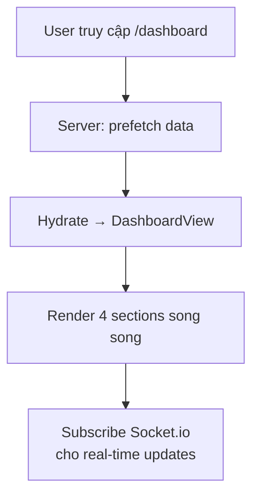
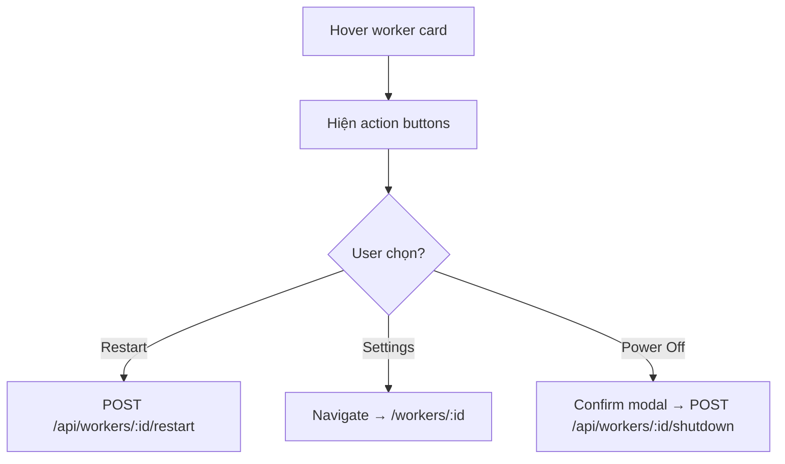
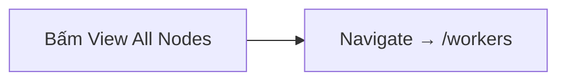

# 🏠 Dashboard Module — Đặc Tả Tính Năng

Module bảng điều khiển tổng quan, hiển thị trạng thái tổng hợp của toàn bộ hệ thống: worker fleet, network throughput, crawl sessions, và system logs theo thời gian thực.

---

## Mục Lục

- [1. Tổng Quan](#1-tổng-quan)
- [2. Cấu Trúc Thư Mục](#2-cấu-trúc-thư-mục)
- [3. Giao Diện](#3-giao-diện)
- [4. Luồng Nghiệp Vụ](#4-luồng-nghiệp-vụ)
- [5. Components](#5-components)
- [6. API Endpoints](#6-api-endpoints)
- [7. State Management](#7-state-management)
- [8. Edge Cases & Error Handling](#8-edge-cases--error-handling)
- [9. Dependencies](#9-dependencies)
- [10. Changelog](#10-changelog)

---

## 1. Tổng Quan

| Thuộc tính | Giá trị |
|------------|---------|
| **Module name** | `dashboard` |
| **Route** | `/dashboard` |
| **Route Group** | `(dashboard)` — DashboardLayout sidebar |
| **Layer** | Business Logic (`modules/dashboard/`) |
| **Status** | Production (UI mock data) |

### 1.1. Mục Đích

Trang tổng quan cho operator/admin — "single pane of glass" để nắm bắt toàn bộ trạng thái hệ thống trong một màn hình. Bao gồm:
- Trạng thái Worker fleet (online/offline, CPU, memory)
- Network throughput chart
- Bảng Crawl Sessions đang chạy
- System logs stream real-time

---

## 2. Cấu Trúc Thư Mục

```text
src/modules/dashboard/
├── components/         ← (Hiện tại inline trong DashboardView)
├── views/
│   └── DashboardView.tsx  ← Entry point: 4 sections
└── index.ts
```

**Planned refactor:**
```text
├── components/
│   ├── DashboardHeader.tsx
│   ├── WorkerManagement.tsx
│   ├── NetworkThroughput.tsx
│   ├── CrawlSessions.tsx
│   ├── SystemLogs.tsx
│   └── index.ts
```

---

## 3. Giao Diện

### 3.1. Dashboard View

**Layout:** Responsive grid, sidebar trái (DashboardLayout)

```
┌──────────────────────────────────────────────────────────┐
│  Operational Dashboard               NODE: ACTIVE  14:02 │
├──────────────────────────────────────────────────────────┤
│                                                          │
│  ┌────────────────────────────┐  ┌──────────────────┐    │
│  │  PC Worker Management     │  │ Network           │    │
│  │  ┌──────────┬──────────┐  │  │ Throughput        │    │
│  │  │ ALPHA_01 │ BETA_09  │  │  │                   │    │
│  │  │ ●Online  │ ●Offline │  │  │ 842.4 MB/s        │    │
│  │  │ CPU: 42% │ Lost     │  │  │ ┌────────────┐    │    │
│  │  │ MEM: 68% │ Reconnect│  │  │ │ BarChart   │    │    │
│  │  └──────────┴──────────┘  │  │ └────────────┘    │    │
│  └────────────────────────────┘  └──────────────────┘    │
│                                                          │
│  ┌──────────────────────────────────────────────────┐    │
│  │  Data Crawl Sessions                    Grid|List│    │
│  ├──────────────────────────────────────────────────┤    │
│  │  SID-88210  │ bloomberg │ Crawling │ ████ 84%   │    │
│  │  SID-88211  │ sentiment │ Verifying│ ████ 100%  │    │
│  │  SID-88212  │ crypto    │ Stalled  │ ██   12%   │    │
│  └──────────────────────────────────────────────────┘    │
│                                                          │
│  ┌──────────────────────────────────────────────────┐    │
│  │  System Logs Stream                    ● LIVE    │    │
│  │  14:02:41 [INFO] Establishing tunnel...          │    │
│  │  14:02:42 [SYNC] Pushing session buffer          │    │
│  │  14:02:43 [WORK] Parser initialized              │    │
│  └──────────────────────────────────────────────────┘    │
└──────────────────────────────────────────────────────────┘
```

---

## 4. Luồng Nghiệp Vụ

### 4.1. Tải Dashboard



### 4.2. Worker Quick Actions



### 4.3. View All Nodes \(Link\)



---

## 5. Components

### 5.1. Các Section Trong DashboardView

| Section | Function name | Mô tả |
|---------|--------------|-------|
| Header | `DashboardHeader` | Title, version, node status, UTC clock |
| Workers | `WorkerManagement` | 2 worker cards (online/offline) với action buttons |
| Network | `NetworkThroughput` | KPI number + BarChart lịch sử throughput |
| Sessions | `CrawlSessions` | Bảng dữ liệu crawl session với progress bars |
| Logs | `SystemLogs` | Real-time log stream terminal |

### 5.2. Design System Components Sử Dụng

| Component | Config | Vị trí |
|-----------|--------|--------|
| `SectionHeader` | `icon`, `title`, `action` | Mỗi section header |
| `IconBox` | `color="primary"` | Worker card icons |
| `Badge` | success/error, dot, pulse | Worker status |
| `ProgressBar` | Various colors, animated | CPU, Memory, Session progress |
| `BarChart` | `color="primary"`, `showTooltip` | Network throughput |
| `StatusDot` | green/blue/orange, pulse | Node status, resource indicators |
| `LogStream` | `live` mode | System logs |
| `Button` | primary, link, icon-ghost, destructive-subtle | Actions |

---

## 6. API Endpoints

| # | Method | Endpoint | Mô tả |
|---|--------|----------|-------|
| 1 | `GET` | `/api/dashboard/summary` | Tổng quan: worker count, session count, uptime |
| 2 | `GET` | `/api/workers?limit=4` | Top workers cho dashboard card |
| 3 | `GET` | `/api/sessions?status=active&limit=5` | Active sessions |
| 4 | `GET` | `/api/network/throughput?range=10m` | Throughput data cho chart |
| 5 | `WS` | `dashboard:logs` | Real-time log stream |
| 6 | `WS` | `dashboard:metrics` | Real-time worker metrics |

---

## 7. State Management

| State | Scope | Công cụ |
|-------|-------|---------|
| Dashboard data | Server | Tanstack Query (auto-refetch) |
| Log stream entries | Server (WebSocket) | Socket.io → query invalidation |
| View mode (grid/list) | Local | `useState` |

> [!TIP]
> Dashboard không cần Zustand module store. Tất cả data là server-driven (Tanstack Query + Socket.io).

---

## 8. Edge Cases & Error Handling

| # | Tình huống | Xử lý |
|---|-----------|-------|
| 1 | Mọi worker offline | Hiển thị alert banner "All nodes disconnected" |
| 2 | Network throughput = 0 | Chart vẫn hiện, tooltip hiện "0 MB/s" |
| 3 | Crawl sessions rỗng | Empty state: "No active sessions" |
| 4 | Log stream disconnected | StatusDot chuyển đỏ, hiển thị "Reconnecting..." |
| 5 | Data loading | Skeleton components cho từng section |

---

## 9. Dependencies

### Internal

| Module / Layer | Mục đích |
|----------------|----------|
| `common/components/ui/*` | Button, Badge, ProgressBar, BarChart, StatusDot, SectionHeader, IconBox, LogStream |
| `service/worker` | Worker data fetch |
| `service/session` | Session data fetch |

### External

| Package | Mục đích |
|---------|----------|
| `lucide-react` | 12 icons sử dụng |

---

## 10. Changelog

| Version | Ngày | Mô tả |
|---------|------|-------|
| 1.0.0 | 2026-03-27 | Khởi tạo: DashboardView với 4 sections, mock data |
| 1.1.0 | 2026-03-29 | Refactored NetworkThroughput sang BarChart component |
