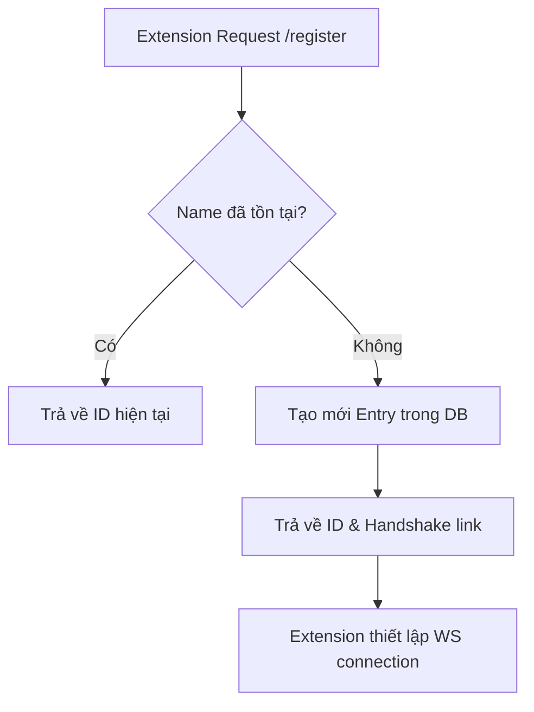

# 🧩 Extensions Module — Đặc Tả Tính Năng

Module quản lý danh sách các Extension (Tác nhân bóc tách dữ liệu) được cài đặt trên các Profile Browser. Cho phép đăng ký, định danh, giám sát trạng thái kết nối và điều khiển các hành động crawl.

---

## Mục Lục

- [1. Tổng Quan](#1-tổng-quan)
- [2. Cấu Trúc Thư Mục](#2-cấu-trúc-thư-mục)
- [3. Giao Diện (UI Screens)](#3-giao-diện-ui-screens)
- [4. Luồng Nghiệp Vụ](#4-luồng-nghiệp-vụ)
- [5. Components](#5-components)
- [6. API Endpoints](#6-api-endpoints)
- [7. State Management](#7-state-management)
- [8. Edge Cases & Error Handling](#8-edge-cases--error-handling)
- [9. Dependencies](#9-dependencies)
- [10. Changelog](#10-changelog)

---

## 1. Tổng Quan

| Thuộc tính | Giá trị |
|------------|---------|
| **Module name** | `extensions` |
| **Route** | `/extensions` |
| **Layer** | Business Logic (`modules/extensions/`) |
| **Status** | `In Development` (UI + Mock Data) |
| **Owner** | Engineering Team |

### 1.1. Mục Đích

Giải quyết vấn đề quản lý tập trung hàng trăm extension chạy trên các profile browser khác nhau:
- **Định danh duy nhất**: Mỗi extension có một Name duy nhất để CS có thể gửi lệnh đúng đối tượng.
- **Giám sát kết nối**: Theo dõi trạng thái CONNECTED/DISCONNECTED qua WebSocket.
- **Điều khiển tập trung**: Gửi lệnh Start/Stop crawl tới từng extension hoặc hàng loạt.
- **Quản lý phiên bản**: Đảm bảo các extension chạy đúng version quy định.

### 1.2. Đối Tượng Sử Dụng

| Vai trò | Quyền hạn |
|---------|----------|
| Admin | Quản lý toàn bộ danh sách, register/unregister, điều khiển |
| Operator | Xem danh sách, kiểm tra trạng thái, kích hoạt session |
| Viewer | Chỉ xem danh sách và trạng thái |

---

## 2. Cấu Trúc Thư Mục

```text
src/modules/extensions/
├── components/            ← Components đặc thù
│   ├── ExtensionStatusBadge.tsx
│   ├── ExtensionDetailPanel.tsx
│   └── index.ts           
├── views/                 ← Entry point views
│   ├── ExtensionsView.tsx
│   └── index.ts
├── types.ts               ← Domain types
├── data/                  ← Mock data (dev only)
│   └── mock-extensions.ts
└── index.ts               ← Barrel export (public API)
```

---

## 3. Giao Diện (UI Screens)

### 3.1. Extensions List Screen

**Mô tả:** Hiển thị danh sách tổng quát các extension dưới dạng bảng, hỗ trợ filter và xem chi tiết nhanh ở Side Panel.

**Layout:**
```
┌──────────────────────────────────────────────────────────┐
│  Extensions Management             [+ Add Ext] [Filter]  │
├──────────────────────────────────────────────────────────┤
│  [Table: ID, Name, Version, Status, Users, Last Upd]     │
│                                                          │
│  [Row click → Open Side Panel]                           │
├──────────────────────────────────────────────────────────┤
│  Pagination                                              │
└──────────────────────────────────────────────────────────┘
```

**Components sử dụng:**
- `SectionHeader`: Tiêu đề trang với icon Puzzle.
- `MetricCard`: Hiển thị nhanh các chỉ số (API Requests, Error Rate).
- `StatusDot`: Hiển thị trực quan trạng thái kết nối.
- `Badge`: Phân loại trạng thái (Success, Neutral, Error).

---

## 4. Luồng Nghiệp Vụ

### 4.1. Đăng ký Extension (Registration)

**Trigger:** Extension mới khởi động trên Browser gửi request đăng ký.



### 4.2. Điều khiển Extension (Control)

**Trigger:** Admin bấm nút Deactivate/Activate trên Dashboard.

1. Admin Dashboard gửi lệnh tới Controller Service (CS).
2. CS tìm socket connection của extension dựa trên ID.
3. CS gửi lệnh qua WebSocket (Emit event).
4. Extension nhận lệnh và thay đổi trạng thái thực thi.

---

## 5. Components

### 5.1. Module-specific Components

| Component | File | Props chính | Mô tả |
|-----------|------|------------|-------|
| `ExtensionStatusBadge` | `ExtensionStatusBadge.tsx` | `status: ExtensionStatus` | Render Badge tùy biến theo trạng thái |
| `ExtensionDetailPanel` | `ExtensionDetailPanel.tsx` | `extension: Extension` | Sliding panel hiển thị thông tin chi tiết |

### 5.2. Design System Components Sử Dụng

| Component | Variant/Config | Mục đích |
|-----------|---------------|----------|
| `Button` | `primary`, `icon-ghost`, `destructive-subtle` | Các hành động tương tác |
| `StatusDot` | `green`, `zinc`, `red` | Chỉ báo trạng thái nhanh |
| `Badge` | `success`, `neutral`, `error` | Label trạng thái |

---

## 6. API Endpoints

| # | Method | Endpoint | Request Body | Response | Mô tả |
|---|--------|----------|-------------|----------|-------|
| 1 | `GET` | `/api/extension/list` | — | `PaginatedResponse<Extension>` | Lấy danh sách extension |
| 2 | `GET` | `/api/extension/get-info/{name}` | — | `ApiResponse<Extension>` | Tìm extension theo Name |
| 3 | `POST` | `/api/extension/register/{name}` | — | `ApiResponse<Extension>` | Đăng ký extension mới |
| 4 | `POST` | `/api/extension/{id}/action` | `{"action": "string"}` | `ApiResponse<void>` | Gửi lệnh thực thi |

---

## 7. State Management

### 7.1. Server State (Tanstack Query)

| Hook | Query Key | Mô tả |
|------|-----------|-------|
| `useExtensionListQuery` | `['extensions', 'list', filters]` | Lấy danh sách extension |
| `useExtensionDetailQuery` | `['extensions', 'detail', id]` | Lấy chi tiết extension |

---

## 8. Edge Cases & Error Handling

| # | Tình huống | Xử lý |
|---|-----------|-------|
| 1 | Trùng Name khi đăng ký | Hệ thống trả về bản ghi cũ hoặc lỗi tùy cấu hình |
| 2 | Mất kết nối Socket | Status chuyển sang DISCONNECTED sau 30s timeout |
| 3 | Lỗi script bên trong Ext | Extension gửi event `ERROR` về CS để cập nhật Dashboard |

---

## 9. Dependencies

### 9.1. Internal
- `common/components/ui`: Nền tảng giao diện.
- `core/utils/cn`: Utility xử lý classname.

### 9.2. External
- `lucide-react`: Hệ thống icon (Puzzle, Help, Play, Pause).

---

## 11. Changelog

| Version | Ngày | Mô tả |
|---------|------|-------|
| 1.0.0 | 2026-04-12 | Khởi tạo tài liệu đặc tả Module Extensions |
