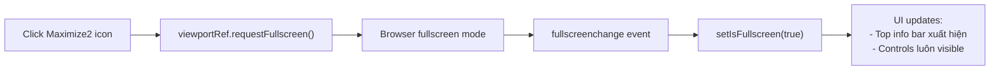
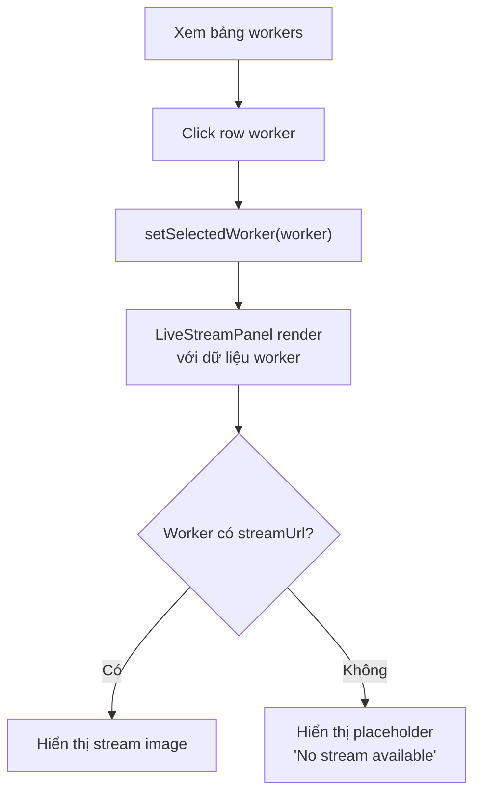
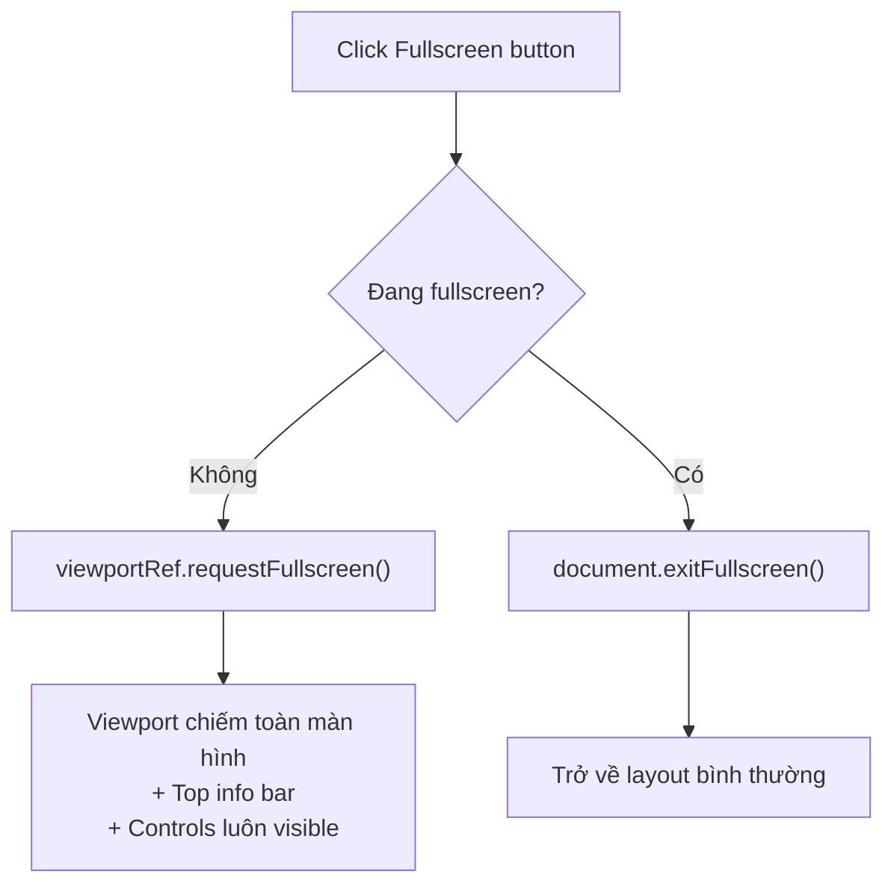
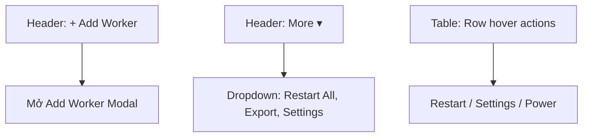

# 🖥️ Workers Module — Đặc Tả Tính Năng

Module quản lý PC Worker fleet: hiển thị trạng thái chi tiết, tài nguyên (CPU/RAM), network speed history, live stream màn hình, và điều khiển từ xa với Fullscreen API.

---

## Mục Lục

- [1. Tổng Quan](#1-tổng-quan)
- [2. Cấu Trúc Thư Mục](#2-cấu-trúc-thư-mục)
- [3. Giao Diện](#3-giao-diện)
- [4. Luồng Nghiệp Vụ](#4-luồng-nghiệp-vụ)
- [5. Components](#5-components)
- [6. Domain Types](#6-domain-types)
- [7. API Endpoints](#7-api-endpoints)
- [8. State Management](#8-state-management)
- [9. Edge Cases & Error Handling](#9-edge-cases--error-handling)
- [10. Dependencies](#10-dependencies)
- [11. Changelog](#11-changelog)

---

## 1. Tổng Quan

| Thuộc tính | Giá trị |
|------------|---------|
| **Module name** | `workers` |
| **Route** | `/workers` |
| **Route Group** | `(dashboard)` — DashboardLayout sidebar |
| **Layer** | Business Logic (`modules/workers/`) |
| **Status** | Production (UI + mock data) |

### 1.1. Mục Đích

Cung cấp trang quản lý chi tiết cho toàn bộ PC workers trong fleet:
- **Bảng tổng quan**: Toàn bộ workers, sắp xếp/filter theo status
- **Real-time metrics**: CPU, RAM, network speed history (sparkline)
- **Live stream**: Stream màn hình worker, hỗ trợ fullscreen native
- **Remote control**: Take Control, restart, terminate từ xa

### 1.2. Đối Tượng Sử Dụng

| Vai trò | Quyền hạn |
|---------|----------|
| Admin | Toàn quyền: view, control, restart, terminate |
| Operator | View + take control |
| Viewer | Chỉ xem bảng và stream |

---

## 2. Cấu Trúc Thư Mục

```text
src/modules/workers/
├── components/
│   ├── WorkerStatusBadge.tsx    ← Status → Badge variant mapping
│   ├── WorkerResourceBars.tsx   ← CPU/RAM ProgressBar pair
│   ├── MiniSparkline.tsx        ← Net speed mini BarChart
│   └── index.ts
├── data/
│   └── mock-workers.ts         ← Mock data (5 workers)
├── views/
│   └── WorkersView.tsx         ← Main view: table + LiveStreamPanel
├── types.ts                    ← Worker domain types
└── index.ts                    ← Barrel export
```

---

## 3. Giao Diện

### 3.1. Workers View — Layout Tổng Thể

```
┌──────────────────────────────────────────────────────────┐
│  Workers Fleet Management         [+ Add Worker] [⚙ More]│
│  5 WORKERS • 4 ONLINE • 1 OFFLINE                        │
├──────────────────────────────────────────────────────────┤
│                                                          │
│  ┌────────────────────────────────┐ ┌──────────────────┐ │
│  │          WORKER TABLE          │ │  LIVE STREAM     │ │
│  │                                │ │  PANEL           │ │
│  │  Name  │ Status│ CPU │ NET    │ │  ┌────────────┐  │ │
│  │  ──────┼───────┼─────┼────    │ │  │  Stream    │  │ │
│  │  α-01  │●ONLINE│ 45% │ ████  │ │  │  Viewport  │  │ │
│  │  α-02  │●BUSY  │ 92% │ ██    │ │  │            │  │ │
│  │  β-01  │●IDLE  │ 12% │ ██████│ │  │  [⛶ Full]  │  │ │
│  │  β-02  │●ONLINE│ 67% │ ████  │ │  ├────────────┤  │ │
│  │  γ-01  │●OFFLN │  —  │  —    │ │  │ Stats:     │  │ │
│  │  ────────────────────────────│ │  │ CPU/RAM/Net │  │ │
│  │  [Click row → select worker] │ │  │ [Take Ctrl] │  │ │
│  └────────────────────────────────┘ └──────────────────┘ │
└──────────────────────────────────────────────────────────┘
```

**Responsive:** Bảng `xl:col-span-2`, stream panel `xl:col-span-1`. Trên mobile, panel xuất hiện bên dưới bảng.

### 3.2. Live Stream Panel

**Trigger:** Click bất kỳ row trong table → Panel hiện ở bên phải

**Cấu trúc:**

| Section | Nội dung |
|---------|----------|
| Header | Worker name + Live badge + latency info + close button |
| Viewport | Stream image + scanline effect + hover controls |
| Stats | Uptime, Temperature, Active Process |
| Resources | CPU ProgressBar + Memory ProgressBar |
| Net History | BarChart sparkline |
| Actions | Take Control, Fullscreen toggle, Settings |

### 3.3. Fullscreen Mode

**Cơ chế:** Native browser Fullscreen API trên viewport `<div>`



**Thoát:** Nhấn `Esc` hoặc click `Minimize2` icon → `document.exitFullscreen()`

---

## 4. Luồng Nghiệp Vụ

### 4.1. Chọn Worker & Xem Stream



### 4.2. Fullscreen Stream



### 4.3. Worker Management Actions



---

## 5. Components

### 5.1. Module-specific Components

| Component | File | Props | Mô tả |
|-----------|------|-------|-------|
| `WorkerStatusBadge` | `WorkerStatusBadge.tsx` | `status: WorkerStatus` | Map status → Badge variant (ONLINE→success, BUSY→warning, OFFLINE→error, IDLE→neutral) |
| `WorkerResourceBars` | `WorkerResourceBars.tsx` | `resources: WorkerResource` | Pair ProgressBar cho CPU + Memory |
| `MiniSparkline` | `MiniSparkline.tsx` | `data: number[]` | Compact BarChart cho net speed history |
| `LiveStreamPanel` | (inline trong WorkersView) | `worker: Worker`, `onClose` | Compound panel: stream + stats + actions + fullscreen |

### 5.2. WorkerStatusBadge Mapping

| Status | Badge variant | Dot | Pulse |
|--------|-------------|-----|-------|
| `ONLINE` | `success` | ✅ | ✅ |
| `BUSY` | `warning` | ✅ | ❌ |
| `IDLE` | `neutral` | ✅ | ❌ |
| `OFFLINE` | `error` | ✅ | ❌ |

### 5.3. Design System Components Sử Dụng

| Component | Config | Vị trí |
|-----------|--------|--------|
| `Button` | primary, secondary, icon-ghost, destructive | Table actions, panel CTA |
| `Badge` | Mapped via WorkerStatusBadge | Status column, stream header |
| `ProgressBar` | color=success/warning/error/info, height=sm | CPU/RAM bars |
| `BarChart` | height=40, gap=3, showTooltip | Net speed sparkline |

---

## 6. Domain Types

```typescript
// modules/workers/types.ts
type WorkerStatus = 'ONLINE' | 'IDLE' | 'BUSY' | 'OFFLINE';

interface WorkerResource {
  cpuPercent: number;        // 0-100
  memPercent: number;        // 0-100
  memLabel?: string;         // "6.4 GB"
}

interface WorkerNetSpeed {
  history: number[];         // 5 values, 0-100 for sparkline
}

interface Worker {
  id: string;
  name: string;              // "WORKER_ALPHA_01"
  ipAddress: string;         // "192.168.1.104"
  status: WorkerStatus;
  resources: WorkerResource;
  netSpeed: WorkerNetSpeed;
  uptime?: string;           // "14d 6h"
  tempCelsius?: number;      // 67
  activeProcess?: string;    // "crawler-v2.exe"
  sessionId?: string;        // "SID-88210-X"
  streamUrl?: string;        // URL for live stream image
}
```

---

## 7. API Endpoints

| # | Method | Endpoint | Request | Response | Mô tả |
|---|--------|----------|---------|----------|-------|
| 1 | `GET` | `/api/workers` | `?status, page, pageSize` | `PaginatedResponse<Worker>` | Danh sách workers |
| 2 | `GET` | `/api/workers/:id` | — | `ApiResponse<WorkerDetail>` | Chi tiết worker |
| 3 | `POST` | `/api/workers` | `CreateWorkerDto` | `ApiResponse<Worker>` | Thêm worker mới |
| 4 | `POST` | `/api/workers/:id/restart` | — | `ApiResponse<void>` | Restart worker |
| 5 | `POST` | `/api/workers/:id/shutdown` | — | `ApiResponse<void>` | Shutdown worker |
| 6 | `GET` | `/api/workers/:id/stream` | — | `StreamURL` | Lấy stream endpoint |
| 7 | `WS` | `worker:metrics` | — | Real-time | Worker metrics stream |
| 8 | `WS` | `worker:statusChanged` | — | Real-time | Status change events |

---

## 8. State Management

| State | Scope | Công cụ |
|-------|-------|---------|
| Worker list data | Server | `useWorkerListQuery` (Tanstack Query) |
| Selected worker | View-local | `useState<Worker | null>` |
| Fullscreen state | Component-local | `useState` + `fullscreenchange` event |
| Worker metrics (real-time) | Server (WebSocket) | Socket.io → query invalidation |

> [!NOTE]
> `selectedWorker` hiện dùng `useState` vì chỉ 1 component cần (WorkersView). Nếu cần share giữa nhiều nơi, migrate sang `modules/workers/store/`.

---

## 9. Edge Cases & Error Handling

| # | Tình huống | Xử lý |
|---|-----------|-------|
| 1 | Worker offline, click stream | Hiển thị `VideoOff` placeholder, disable Take Control |
| 2 | Stream URL bị mất | Chuyển về placeholder state |
| 3 | Fullscreen API bị block (không user gesture) | Swallow error, log warning |
| 4 | CPU > 80% | ProgressBar auto chuyển sang `color="error"` |
| 5 | CPU 50-79% | ProgressBar auto chuyển sang `color="warning"` |
| 6 | Temperature > 75°C | Text chuyển `text-red-400` |
| 7 | Không có workers | Empty state: "No workers registered" |
| 8 | User nhấn Esc khi fullscreen | `fullscreenchange` event → setIsFullscreen(false) |

---

## 10. Dependencies

### Internal

| Module / Layer | Mục đích |
|----------------|----------|
| `common/components/ui/Button` | Actions, CTA |
| `common/components/ui/Badge` | Status indicators (via WorkerStatusBadge) |
| `common/components/ui/ProgressBar` | CPU/RAM visualization |
| `common/components/ui/BarChart` | Network speed sparkline |
| `common/utils/cn` | Class merging |

### External

| Package | Mục đích |
|---------|----------|
| `lucide-react` | 15+ icons |
| Browser Fullscreen API | Native fullscreen cho stream viewport |

---

## 11. Changelog

| Version | Ngày | Mô tả |
|---------|------|-------|
| 1.0.0 | 2026-03-29 | Khởi tạo: WorkersView, table, LiveStreamPanel, domain types, mock data |
| 1.1.0 | 2026-03-29 | Fullscreen API integration cho LiveStreamPanel |
